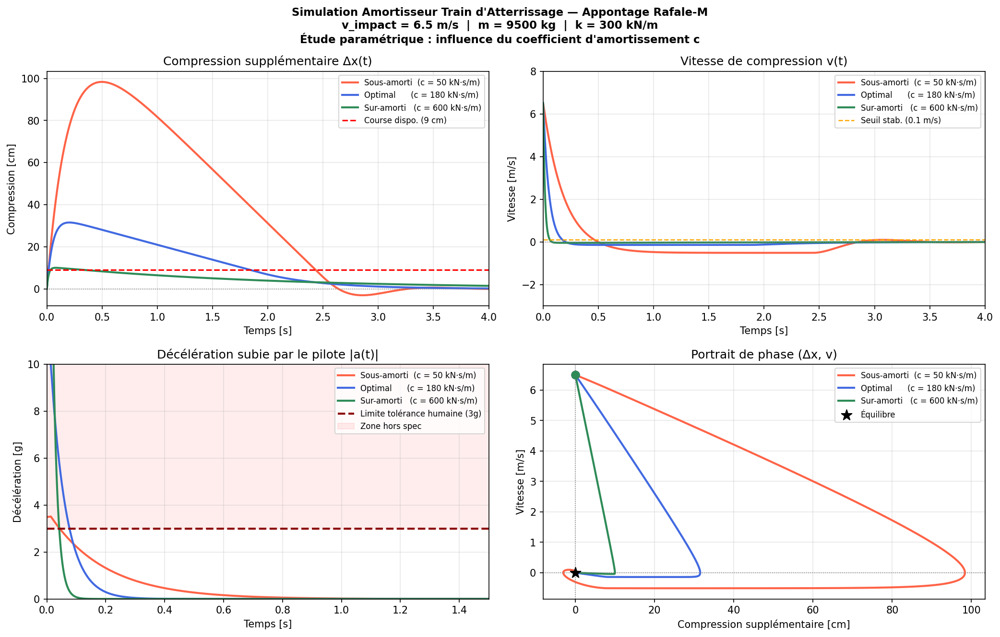

#  Simulation Amortisseur Train d'Atterrissage — Appontage Rafale-M

Simulation numérique du comportement d'un amortisseur de train d'atterrissage lors d'un appontage sur porte-avions.  
Projet inspiré d'un travail académique réalisé en partenariat avec **Safran Landing Systems** (ENIB, 2025).

---

##  Physique du problème

L'amortisseur est modélisé comme un **système masse-ressort-amortisseur du 2nd ordre** :

```
m·x''(t) + c·x'(t) + k·x(t) = m·g
```

| Paramètre | Signification | Valeur |
|-----------|--------------|--------|
| `m` | Masse aéronef | 9 500 kg |
| `k` | Raideur ressort pneumatique | 300 kN/m |
| `c` | Coefficient d'amortissement | variable |
| `v_impact` | Vitesse verticale d'appontage | **6,5 m/s** (spec Rafale-M) |

---

## 🎯 Critères de validation (normes Safran Landing Systems)

| Critère | Limite | Signification |
|---------|--------|---------------|
| Décélération pilote | **< 3g** | Tolérance humaine aux accélérations |
| Course amortisseur | < course disponible | Pas de butée mécanique |
| Temps de stabilisation | **< 2 s** | Retour à l'équilibre rapide |

---

##  Résultats — Étude paramétrique



Comparaison de **3 configurations d'amortissement** :

| Configuration | Décélération max | Course max | Stabilisation |
|---------------|-----------------|------------|---------------|
| Sous-amorti (c = 50 kN·s/m) | élevée | très grande | lente |
| **Optimal (c = 180 kN·s/m)** | **modérée** | **acceptable** | **rapide** |
| Sur-amorti (c = 600 kN·s/m) | très élevée | faible | très rapide |

---

## 🛠️ Technologies

- **Python 3**
- **NumPy** — calcul numérique
- **SciPy** — intégration ODE (méthode Runge-Kutta RK45)
- **Matplotlib** — visualisation 4 graphiques

---

##  Lancer la simulation

```bash
git clone https://github.com/keitaaboubacar0611-hue/simulation-train-atterrissage.git
cd simulation-train-atterrissage

pip install numpy scipy matplotlib

python simulation_appontage.py
```

---

##  Modifier les paramètres

```python
m        = 9500.0    # Masse aéronef [kg]
k        = 300000.0  # Raideur [N/m]
v_impact = 6.5       # Vitesse d'impact [m/s]

configs = [
    {"label": "...", "c": 50_000,  ...},   # Modifier c ici
    {"label": "...", "c": 180_000, ...},
    {"label": "...", "c": 600_000, ...},
]
```

---

##  Structure du projet

```
simulation-train-atterrissage/
├── simulation_appontage.py    # Script principal
├── resultats_appontage.png    # Graphiques générés
├── .gitignore
└── README.md
```

---

##  Auteur

**Keita Aboubacar** — Étudiant ingénieur ENIB, Brest  
 keitaaboubacar0611@gmail.com  
 [github.com/keitaaboubacar0611-hue](https://github.com/keitaaboubacar0611-hue)
